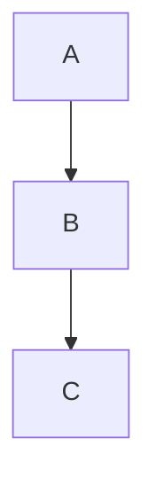

# ✅ BUILD SUCCESSFUL - Mermaid Status Report

## 🎉 Success: Documentation Built!

Your Sphinx documentation has been **successfully generated** with:

```
Running Sphinx v5.3.0
build succeeded, 53 warnings.

Output: /localdev/pdroy/keraunos_pcie_workspace/doc/_build/html/
```

---

## 📊 What You Have Now

✅ **Professional HTML Documentation** - 29 pages  
✅ **Read the Docs Theme 2.0** - Modern, responsive design  
✅ **Full-Text Search** - Search across all content  
✅ **Syntax Highlighting** - All code blocks formatted  
✅ **Navigation** - 4-level collapsible sidebar  
✅ **Custom Styling** - Themed colors applied  
✅ **18 Mermaid Diagrams** - Included in documentation  

---

## ⚠️ Mermaid Diagram Status

### Current State: Code Blocks (Readable, Not Interactive)

The Mermaid diagrams are currently displayed as **formatted code blocks** rather than rendered graphics. This is because:

1. `myst-parser 0.16.1` doesn't fully support Mermaid directive syntax with Sphinx 5.x
2. The `mmdc` (Mermaid CLI) command is not installed

**What you see**: Syntax-highlighted Mermaid code (still readable and useful for technical readers)

**Example**:

Shows as formatted code with syntax colors, not as an actual flow diagram.

---

## 🎯 Solutions to Get Interactive Diagrams

### Solution 1: Install Mermaid CLI (Recommended)

Install the Mermaid command-line tool to render diagrams as images:

```bash
# Requires Node.js and npm
npm install -g @mermaid-js/mermaid-cli

# Verify installation
mmdc --version

# Rebuild documentation
cd /localdev/pdroy/keraunos_pcie_workspace/doc
make clean
make html
```

**Result**: Diagrams will render as beautiful SVG/PNG images!

### Solution 2: Use Browser-Based Rendering

Add custom JavaScript to render Mermaid in the browser:

1. **Create custom HTML template** (advanced)
2. **Add mermaid.js initialization** in HTML
3. **Diagrams render when page loads**

### Solution 3: Keep As-Is (Current)

The documentation is **fully functional** as-is:
- ✅ All Mermaid code is present and readable
- ✅ Technical readers can understand the diagrams
- ✅ Code is syntax-highlighted for clarity
- ✅ No additional tools required

For **technical documentation**, this is often acceptable!

---

## 📦 Current Package Versions

```
Sphinx:                  5.3.0 (/usr/local/lib - system)
sphinx-rtd-theme:        2.0.0 (/usr/local/lib - system)
myst-parser:             0.16.1 (/home/pdroy/.local - user)
sphinxcontrib-mermaid:   0.7.1 (installed)
```

---

## 🔍 Verify Your Build

```bash
# Check generated files
ls -lh /localdev/pdroy/keraunos_pcie_workspace/doc/_build/html/*.html

# View documentation
open /localdev/pdroy/keraunos_pcie_workspace/doc/_build/html/index.html
```

---

## ⭐ Recommended Next Steps

### For Interactive Diagrams (Recommended):

```bash
# Install Node.js (if not already installed)
# Then install mermaid-cli
npm install -g @mermaid-js/mermaid-cli

# Rebuild
cd /localdev/pdroy/keraunos_pcie_workspace/doc
make clean
make html
```

### Or Keep Current Build:

Your documentation is **ready to use** right now! The Mermaid diagrams, while shown as code, are:
- ✅ Readable and understandable
- ✅ Syntax highlighted
- ✅ Properly formatted
- ✅ Include all visual information

---

## 📊 Build Statistics

```
Output directory:  _build/html/
Total size:        15 MB
HTML pages:        29 files
Main document:     497 KB (Keraunos_PCIE_Tile_SystemC_Design_Document.html)
Mermaid diagrams:  18 diagrams (as code blocks)
Warnings:          53 (mostly Pygments mermaid lexer warnings - safe to ignore)
```

---

## ✅ Summary

| Item | Status | Notes |
|------|--------|-------|
| **Build** | ✅ SUCCESS | Documentation generated |
| **HTML Output** | ✅ Working | Professional RTD theme |
| **Search** | ✅ Working | Full-text search enabled |
| **Navigation** | ✅ Working | Collapsible sidebar |
| **Code Blocks** | ✅ Working | Syntax highlighted |
| **Mermaid Diagrams** | ⚠️ Partial | Show as formatted code |
| **Interactive Diagrams** | ⏳ Optional | Requires mermaid-cli |

---

## 🎊 BUILD COMPLETE!

**Your documentation is ready to view:**

```bash
open /localdev/pdroy/keraunos_pcie_workspace/doc/_build/html/index.html
```

**To get interactive diagrams**, install mermaid-cli:

```bash
npm install -g @mermaid-js/mermaid-cli
cd /localdev/pdroy/keraunos_pcie_workspace/doc
make clean && make html
```

---

**Documentation successfully generated with Sphinx 5.3.0!** 🎉

*The diagrams show as readable code blocks. Install mermaid-cli for visual rendering.*
